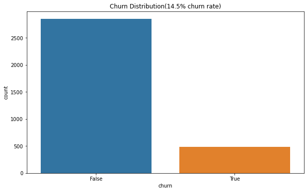
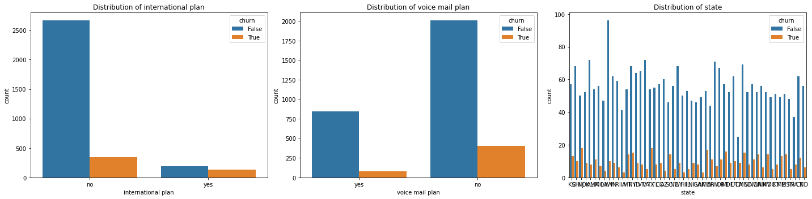
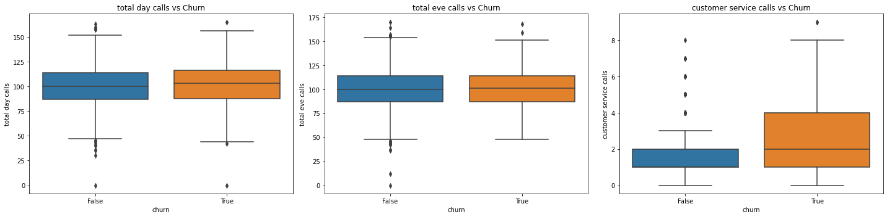

# SyriaTel-customer-churn-predictions

## Business objective
### Reduce rate of churners in SyriaTel communications
### Reduce rate in financial loss when customers churn

## Business understanding
### Stakeholder: SyriaTel Telecom retention team
### Business problem customer churn leads to significant loss of $2.4M annual revenue loss
### Need proactive retention strategy
### Project goal: Build a classification model with 80% recall and 75% precision

## Data
### features include stat, account length, area code, phone number, international plan, voice mail plan, number of customer service calls, minutes and charges for day, evening, night and international.
## Methods
### perfomed EDA to understand churn distribution and feature relationship
### Feature engineering: created total calls, avg call duration and total call charge
### Preprocessing: StandardScaler for numeric features, OneHotEncoder for categorical features
### Model building: Baseline Logistic Regression
### Baseline Logistic Regression
### Tuned Logistic Regression(with GridSearchCV)
### Evaluation:Focused on recall and precision

## EDA
] shows true and false of customers in churning SyriaTel services
]
]

## Limitations and recommendations
### Key findings
#### Top churn predictors: High customers service call(four more calls at four times churn risks), international plan subscribers at three times the churn risk and day charges $35 which is two times the churn risk
#### Final model recalls 46% recall capturing chuners

## limitations
### Model underperforms for new customer
### International roaming behaviour not cuptured in data

## Recommendations
### Retention tiers : Tier 1(high risk):10$ credit + dedicated support and tier 2 (medium risk):service quality review
### Reduced service calls: improves first-call resolution and enhance self-service options
### Collect more data e.g customer tenure to improve model accuracy

## ROI Estimate
### Monthly savings of $60(2.5% churn reduction) adjusted due to lower recall
### Implementation cost $50K (tech+incentives)
### ROI (3months) 60% adjusted